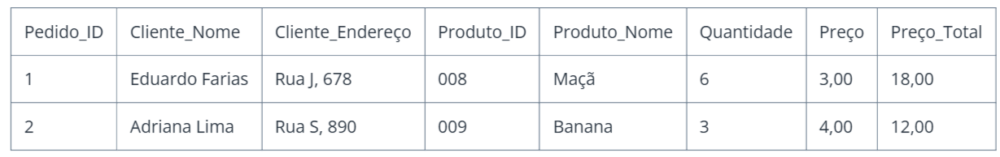
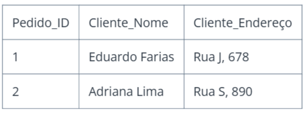
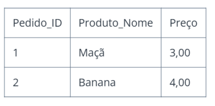
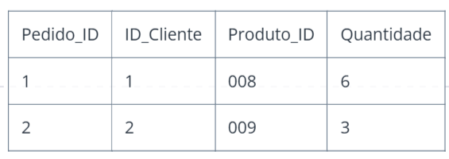

# Explorando Banco de Dados Relacional No Relacional e Normalização:

## O que é um Banco de Dados?
Um banco de dados é uma coleção organizada e estruturada de informações, armazenadas de forma a permitir o acesso, a manipulação e a recuperação eficiente dos dados.
Ele é projetado para armazenar grandes quantidades de dados de diferentes tipos, como textos, números, imagens e vídeos, em formato eletrônico, oferecendo suporte a diversas aplicações e sistemas.
### Um exemplo:
A Ana tem uma mochila cheia de coisas: lápis, caderno, lanche, livro, régua…

Se tudo estiver jogado lá dentro, é difícil encontrar o que ela quer.
Mas se ela usar estojos e bolsinhos organizados, fica fácil achar o lápis ou o lanche rapidinho.

- Essa mochila organizada é como um banco de dados:
guarda várias informações, de forma arrumada, para encontrar tudo fácil e rápido.

## O que é um banco de dados relacional?
Um banco de dados relacional é um tipo específico de banco de dados que organiza e armazena os dados em tabelas com estrutura pré-definida.

Nesse modelo, os dados são organizados em linhas e colunas, onde cada tabela representa uma entidade ou um conjunto de entidades relacionadas.

As colunas representam os atributos ou características dessas entidades, enquanto as linhas contêm os registros ou instâncias dessas entidades.

E para interagir com esses bancos relacionais de dados, utilizamos os SGBDs.
### Exemplo prático

## O que é um banco de dados não relacional?
O banco de dados não relacional é um banco de dados que possibilita a flexibilidade na hora de armazenar os dados, já que não se limita a tabelas com linhas e colunas, como o banco de dados relacional. Esse tipo de banco de dados usa um modelo de armazenamento otimizado, que é adaptável para o requisito específico de cada dado, por exemplo: possibilita que os dados sejam armazenados como chave/valor simples; documento no formato JSON (JavaScript Object Notation) ou até mesmo em forma de gráfico, composto de bordas e vértices.
### Exemplo:
Um banco de dados não relacional é usado quando os dados são variados e não seguem uma estrutura fixa. Por exemplo, em um app de delivery, cada pedido pode ter informações diferentes (cupom, avaliação, extras), e um banco como o MongoDB permite armazenar tudo de forma flexível e rápida, sem depender de tabelas.

## O que é a normalização e qual seus objetivos?
A normalização é o processo de organizar dados em um banco relacional para evitar repetições, corrigir inconsistências e melhorar a integridade e eficiência. Ela separa as informações em tabelas menores e relacionadas, facilitando a manutenção e reduzindo o uso de espaço.

## Exemplo de tabela não normalizada:

### 1- Tabela clientes:

### 2- Tabela Produtos:

### 3- Tabela Pedidos

## Tabela em Json:
{
 
  "pedido_id": 2,
  
  "cliente": {
   
   
  "nome": "Adriana Lima",
    "endereco": "Rua S, 890"
  },
 
  "itens": [
    
    {
      "produto_id": 009,
      "nome": "Banana",
      "quantidade": 3,
      "preco_total": 12.00
    },

  
  ]

}

